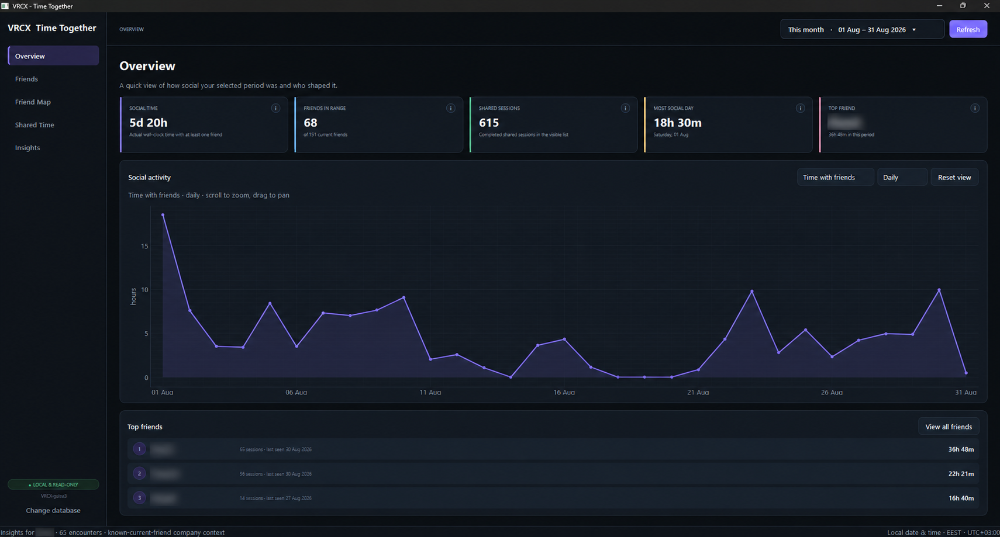
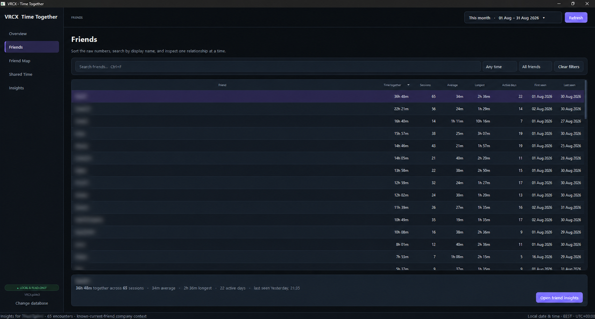
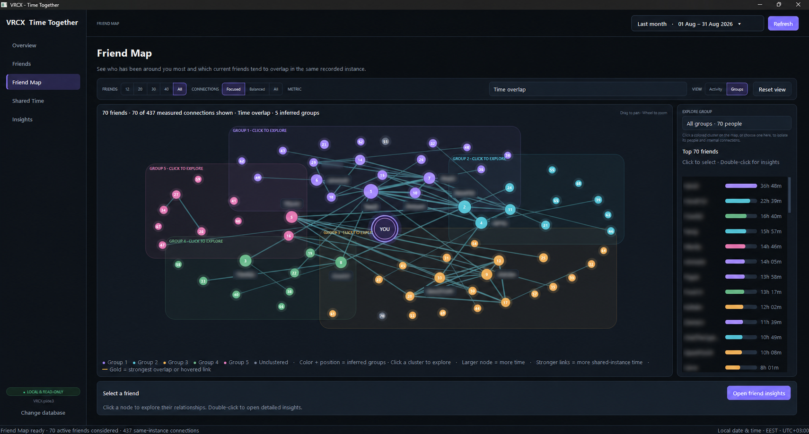
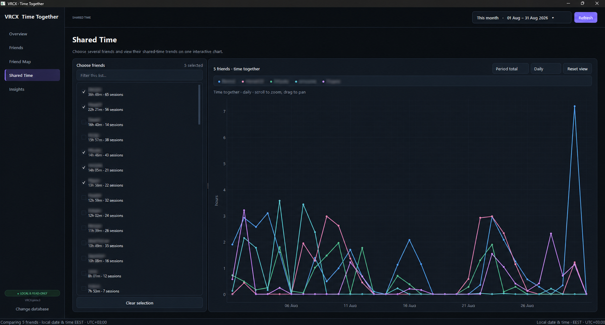
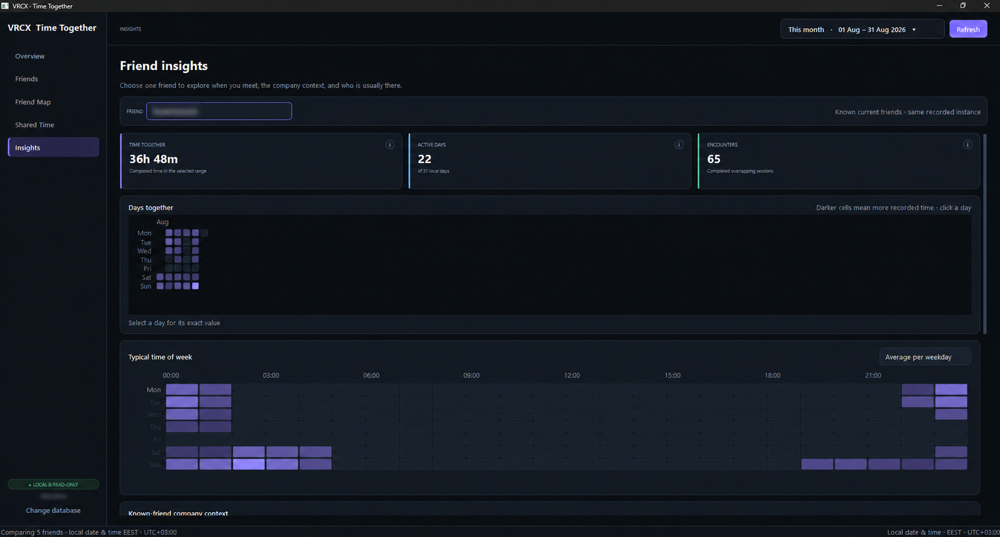
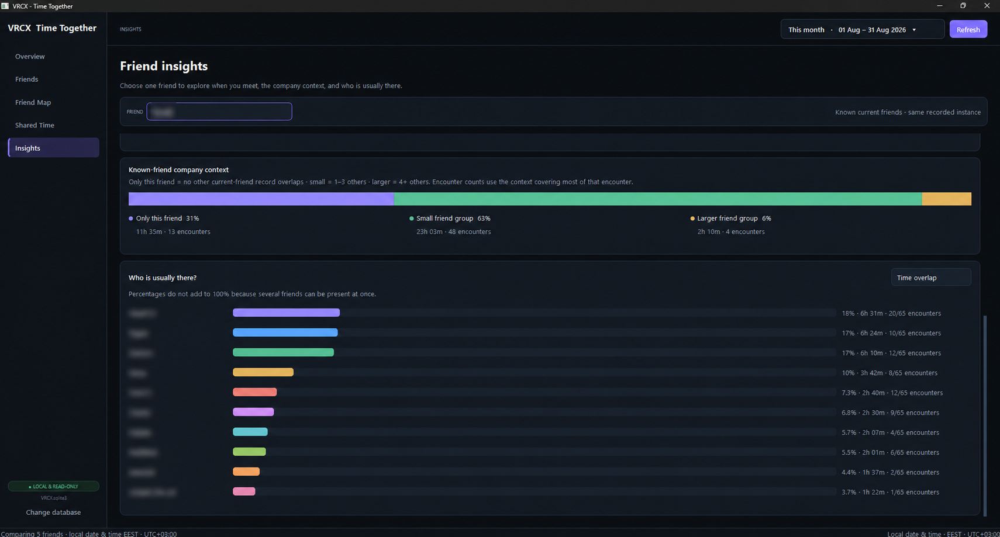

# VRCX Time Together

> Your VRChat history, made easier to understand.

VRCX Time Together is a private companion app for VRCX. It runs separately and analyzes the local SQLite history that VRCX stores, turning it into clear timelines, relationship statistics, co-presence maps, and per-friend patterns—without sending that history anywhere.



It reads the SQLite database maintained by VRCX locally in strict read-only mode. The app does not modify VRCX or its data, use telemetry, or send data to remote services.

## Highlights

- **Overview dashboard** — period-aware KPIs, social activity trends, and top friends.
- **Friend Map** — explore measured same-instance overlap, inferred social groups, and every active friend in the selected period.
- **Shared Time** — view several friends’ time together on zoomable daily, weekly, or monthly timelines.
- **Friend Insights** — calendar and time-of-week heatmaps, company context, and co-presence rankings.
- **Friend search** — filter and sort relationships by time, sessions, active days, and first or last seen dates.
- **Flexible local dates** — quick presets plus exact custom date ranges, interpreted in local time.
- **Your database, your choice** — use the database VRCX stores automatically or select another VRCX SQLite database.
- **Private by design** — entirely local, read-only analysis with no telemetry.

## Features

### Overview

The Overview page is the starting point for a selected period. It summarizes social time, friend count, shared sessions, your most social day, and top friend. Its zoomable activity chart shows when you were social, while the ranked list makes the biggest relationships immediately visible.

### Friends

Use the Friends page as the sortable record of your relationships. Search by display name, filter the range, and sort by total time together, sessions, average or longest session, active days, and first or last seen date. Select a row to see a concise summary, then open detailed insights for that friend.



### Friend Map

The Friend Map visualizes which current friends share recorded VRChat instances. Switch between **Activity** colors and inferred **Groups**, show a focused subset or every active friend in the selected period, and tune how many measured connections appear. The map remains navigable at large scales with pan, zoom, friend selection, and direct access to detailed insights.



#### Explore friend groups

Groups are inferred from repeated, measured overlap in the same known VRChat instance. Color and position make recurring circles easier to recognize without claiming that the people are necessarily friends with one another. Click a colored cluster—or choose it from **Explore group**—to fade unrelated activity and inspect that group on its own. The side panel then lists every member, combined around-you time, internal connection count, and strongest measured pair. People without enough grouping evidence remain visibly separated as unclustered nodes.

#### How to read the Friend Map

- **Activity colors** indicate rank for the selected period: purple is the top 5, cyan is 6–10, blue is 11–20, and green is 21+.
- **Group colors** identify inferred same-instance communities. Select a cluster to reveal more member labels and isolate its internal connections; choose **All groups** or press `Esc` to return.
- **Node size** represents recorded time around you; friends with stronger measured relationships tend to be positioned closer together.
- **Connections** require both friends to have been recorded in the same known VRChat instance. A brighter or thicker line means a stronger value for the selected metric.
- **Gold** highlights the selected friend’s strongest overlap, and also marks the connection under the pointer.

### Shared Time

Choose several friends to view their time with you side by side on a shared interactive chart. Filter the picker, adjust the selected people, and switch between daily, weekly, and monthly views or period and cumulative totals. Distinct stable colors make recurring patterns easy to spot.



### Friend Insights

Select one friend to examine the shape of your time together. The insights page combines headline statistics with a calendar heatmap, a weekday-and-hour rhythm view, company-size breakdown, and a ranked list of friends who are usually there too. Co-presence is based on overlapping reconstructed sessions in the same recorded VRChat instance.





## How metrics work

- **Social time** is wall-clock time where at least one current friend was present. Overlapping time with multiple friends is counted once.
- **Person-time** is time summed for each friend. One hour with three friends contributes three person-hours.
- **Sessions** use completed `OnPlayerLeft` records and are clipped to the active local-date range.
- **Company context** includes only known current friends whose reconstructed sessions overlap in time and share the same recorded location. It is not a count of every person in the VRChat instance.

Only people in the active account’s current-friends table are included. This matches VRCX’s original top-friends behavior.

## Run from source

Install the required UI and timezone dependencies:

```powershell
py -3 -m pip install -r .\requirements.txt
```

Then double-click `vrc-time-together.pyw`, or run:

```powershell
py -3 .\vrc-time-together.pyw
```

The app first looks for `VRCX.sqlite3` beside the script, then at `%APPDATA%\VRCX\VRCX.sqlite3`. Use **Change database** to select a different database. The chosen validated path is remembered, and **Use automatic path** returns to the default lookup order.

The connection uses SQLite URI read-only mode plus `PRAGMA query_only`; writes, schema changes, and migrations are not permitted.

### Date ranges and database location

Choose from **Today**, **Last 7/30/90 days**, **This month**, **Last month**, **This year**, or **All time**, or enter exact start and end dates. All ranges use local calendar dates and timezone-aware boundaries. The app first checks for `VRCX.sqlite3` beside the script, then `%APPDATA%\VRCX\VRCX.sqlite3`; **Change database** selects another location and **Use automatic path** restores that lookup order.

## Keyboard shortcuts

| Shortcut | Action |
| --- | --- |
| `Ctrl+F` | Focus the current page’s search field |
| `Escape` | Clear contextual input |
| `F5` | Refresh data from VRCX |
| `Ctrl+1`–`Ctrl+4` | Switch pages |

Interactive charts support mouse-wheel zoom, drag-to-pan, and a one-click reset view control.

## Prebuilt Windows application

No Python installation is required for packaged builds.

1. In the repository’s **Actions** tab, open a completed **Windows build and release** workflow run.
2. Download `VRCX-Time-Together-windows-x64` from **Artifacts**.
3. Extract the ZIP. It contains a standalone `.exe`, a portable application ZIP, and SHA-256 checksums.
4. Run `VRCX-Time-Together-1.2.0-<commit>-windows-x64.exe`, or extract the portable ZIP and run `VRCX Time Together.exe`. Keep its `_internal` directory beside the executable.

For tagged releases, the standalone `.exe` and portable ZIP are also available from the repository’s **Releases** page.

## Privacy and local data

VRCX Time Together is intentionally local-first. It:

- reads only the local SQLite database maintained by VRCX;
- opens that database read-only;
- performs no telemetry or remote synchronization; and
- stores only technical diagnostic logs under `%LOCALAPPDATA%\VRCX Time Together`, without friend-history data.

## Validate and test

Validate a database without opening the interface:

```powershell
py -3 .\vrc-time-together.pyw --check
```

Run the focused domain tests:

```powershell
py -3 -m unittest discover -s tests -v
```

## Architecture

`vrc-time-together.pyw` is the directly launchable Windows entry point. The PySide6/Qt interface and its framework-independent data layer are organized as follows:

- `qt_app.py` — application shell, pages, models, and background workers
- `qt_chart.py` — accelerated interactive time-series charts
- `qt_friend_map.py` — zoomable co-presence network visualization
- `qt_insights.py` — calendar, weekly rhythm, company-context, and co-presence visualizations
- `qt_theme.py` — palette, component styling, and chart colors
- `repository.py` — cached read-only queries and session aggregation
- `models.py` — typed application state and result models
- `timezone_utils.py` — UTC/local conversions and range boundaries

## Technologies

- **Python** provides the application and data-processing layer.
- **PySide6** delivers the native Qt 6 Windows interface.
- **PyQtGraph** powers interactive time-series visualizations.
- **SQLite** is the local history database maintained by VRCX, opened read-only by this app.
- **PyInstaller** produces standalone and portable Windows packages.
- **GitHub Actions** tests, builds, creates SHA-256 checksums, and publishes tagged releases.

## Build the Windows application

Windows releases use the committed PyInstaller specifications and the pinned versions in `requirements-build.txt`.

```powershell
py -3.13 -m venv .venv-build
.\.venv-build\Scripts\python.exe -m pip install -r .\requirements-build.txt
.\.venv-build\Scripts\python.exe -m PyInstaller --noconfirm --clean .\packaging\windows\VRCX-Time-Together.spec
.\.venv-build\Scripts\python.exe -m PyInstaller --noconfirm --clean .\packaging\windows\VRCX-Time-Together-OneFile.spec
```

The portable build is created at `dist\VRCX Time Together\VRCX Time Together.exe` and must be distributed with its whole folder. The standalone build is created at `dist\VRCX Time Together Standalone.exe`.

The **Windows build and release** GitHub Actions workflow can also be run manually. A tag matching the application version builds and tests both packages, creates SHA-256 checksums, and publishes a GitHub Release:

```powershell
git tag v1.2.0
git push origin v1.2.0
```

Before a later release, update both `vrc_time_together.__version__` and `packaging/windows/version_info.txt` to the same version. The workflow rejects mismatched release tags.
