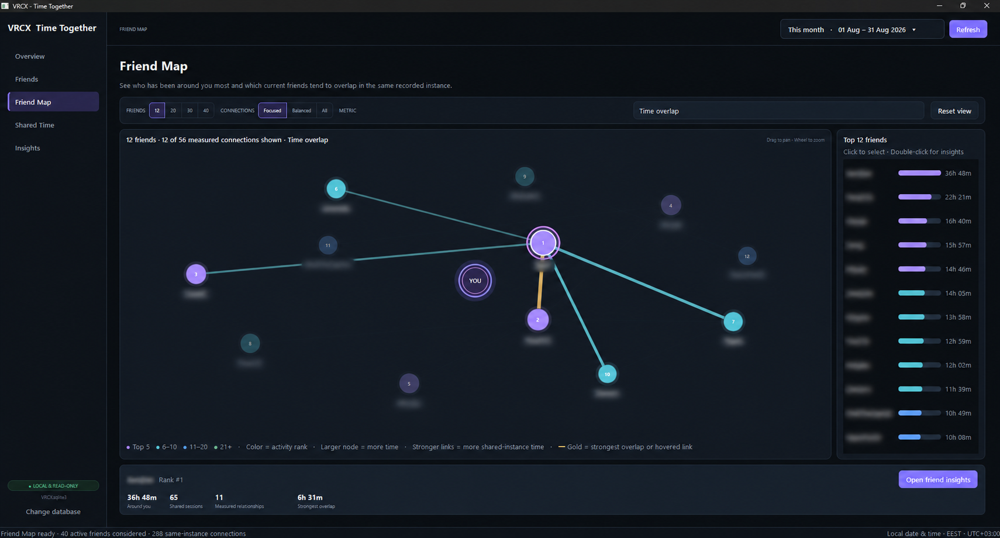

# VRCX Time Together

VRCX Time Together is a private Windows desktop dashboard for understanding the time you spend with your VRChat friends. It turns local VRCX history into clear timelines, relationship statistics, co-presence maps, and per-friend patterns.

Everything stays on your computer: the application opens the VRCX SQLite database in read-only mode, sends no telemetry, and never writes to or migrates your VRCX data.

## At a glance

- Explore social time in a selected local-date range.
- See which friends you met most, how often, and for how long.
- Compare several friends on one interactive timeline.
- Discover friend groups and repeated co-presence through the Friend Map.
- Inspect one friend’s days, usual hours, company context, and recurring co-presence.

## Features

### Overview

The Overview page is the starting point for a selected period. It summarizes social time, friend count, shared sessions, your most social day, and top friend. Its zoomable activity chart shows when you were social, while the ranked list makes the biggest relationships immediately visible.


### Friends

Use the Friends page as the sortable record of your relationships. Search by display name, filter the range, and sort by total time together, sessions, average or longest session, active days, and first or last seen date. Select a row to see a concise summary, then open detailed insights for that friend.


### Friend Map

The Friend Map visualizes which current friends share recorded VRChat instances. Node size represents time around you, colors show activity rank, and stronger links mean more shared-instance time. Switch between focused, balanced, and full connection views; choose how many friends to show; pan, zoom, select, and open a friend’s insights directly from the map.



### Shared Time

Choose several friends to compare their time with you on a shared interactive chart. Filter the picker, adjust the selected people, and switch between daily, weekly, and monthly views or period and cumulative totals. Distinct stable colors make recurring patterns and differences easy to spot.


### Friend Insights

Select one friend to examine the shape of your time together. The insights page combines headline statistics with a calendar heatmap, a weekday-and-hour rhythm view, company-size breakdown, and a ranked list of friends who are usually there too. Co-presence is based on overlapping reconstructed sessions in the same recorded VRChat instance.


## How metrics work

- **Social time** is wall-clock time where at least one current friend was present. Overlapping time with multiple friends is counted once.
- **Person-time** is time summed for each friend. One hour with three friends contributes three person-hours.
- **Sessions** use completed `OnPlayerLeft` records and are clipped to the active local-date range.
- **Company context** includes only known current friends whose reconstructed sessions overlap in time and share the same recorded location. It is not a count of every person in the VRChat instance.

Only people in the active account’s current-friends table are included. This matches VRCX’s original top-friends behavior.

## Run from source

Install the required UI and timezone dependencies:

```powershell
py -3 -m pip install -r .\requirements.txt
```

Then double-click `vrc-time-together.pyw`, or run:

```powershell
py -3 .\vrc-time-together.pyw
```

The app first looks for `VRCX.sqlite3` beside the script, then at `%APPDATA%\VRCX\VRCX.sqlite3`. Use **Change database** to select a different database. The chosen validated path is remembered, and **Use automatic path** returns to the default lookup order.

The connection uses SQLite URI read-only mode plus `PRAGMA query_only`; writes, schema changes, and migrations are not permitted.

## Keyboard shortcuts

| Shortcut | Action |
| --- | --- |
| `Ctrl+F` | Focus the current page’s search field |
| `Escape` | Clear contextual input |
| `F5` | Refresh data from VRCX |
| `Ctrl+1`–`Ctrl+4` | Switch pages |

Interactive charts support mouse-wheel zoom, drag-to-pan, and a one-click reset view control.

## Prebuilt Windows application

No Python installation is required for packaged builds.

1. In the repository’s **Actions** tab, open a completed **Windows build and release** workflow run.
2. Download `VRCX-Time-Together-windows-x64` from **Artifacts**.
3. Extract the ZIP. It contains a standalone `.exe`, a portable application ZIP, and SHA-256 checksums.
4. Run `VRCX-Time-Together-1.1.0-<commit>-windows-x64.exe`, or extract the portable ZIP and run `VRCX Time Together.exe`. Keep its `_internal` directory beside the executable.

For tagged releases, the standalone `.exe` and portable ZIP are also available from the repository’s **Releases** page.

## Privacy and local data

VRCX Time Together is intentionally local-first. It:

- reads a local VRCX database only;
- opens that database read-only;
- performs no telemetry or remote synchronization; and
- stores only technical diagnostic logs under `%LOCALAPPDATA%\VRCX Time Together`, without friend-history data.

## Validate and test

Validate a database without opening the interface:

```powershell
py -3 .\vrc-time-together.pyw --check
```

Run the focused domain tests:

```powershell
py -3 -m unittest discover -s tests -v
```

## Architecture

`vrc-time-together.pyw` is the directly launchable Windows entry point. The PySide6/Qt interface and its framework-independent data layer are organized as follows:

- `qt_app.py` — application shell, pages, models, and background workers
- `qt_chart.py` — accelerated interactive time-series charts
- `qt_friend_map.py` — zoomable co-presence network visualization
- `qt_insights.py` — calendar, weekly rhythm, company-context, and co-presence visualizations
- `qt_theme.py` — palette, component styling, and chart colors
- `repository.py` — cached read-only queries and session aggregation
- `models.py` — typed application state and result models
- `timezone_utils.py` — UTC/local conversions and range boundaries

## Build the Windows application

Windows releases use the committed PyInstaller specifications and the pinned versions in `requirements-build.txt`.

```powershell
py -3.13 -m venv .venv-build
.\.venv-build\Scripts\python.exe -m pip install -r .\requirements-build.txt
.\.venv-build\Scripts\python.exe -m PyInstaller --noconfirm --clean .\packaging\windows\VRCX-Time-Together.spec
.\.venv-build\Scripts\python.exe -m PyInstaller --noconfirm --clean .\packaging\windows\VRCX-Time-Together-OneFile.spec
```

The portable build is created at `dist\VRCX Time Together\VRCX Time Together.exe` and must be distributed with its whole folder. The standalone build is created at `dist\VRCX Time Together Standalone.exe`.

The **Windows build and release** GitHub Actions workflow can also be run manually. A tag matching the application version builds and tests both packages, creates SHA-256 checksums, and publishes a GitHub Release:

```powershell
git tag v1.1.0
git push origin v1.1.0
```

Before a later release, update both `vrc_time_together.__version__` and `packaging/windows/version_info.txt` to the same version. The workflow rejects mismatched release tags.
